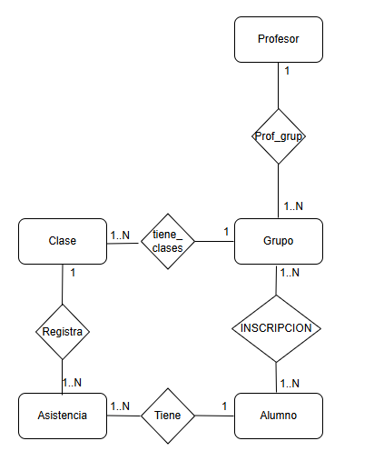

# Sprint 1 - Modelado del dominio

## Objetivo

Diseñar el modelo de dominio de AquaControl y preparar la estructura base del proyecto para comenzar el desarrollo.

---

## Historias de Usuario

### HU-001
Como profesor de natación,
quiero administrar grupos de alumnos,
para organizar mis clases.

### HU-002
Como profesor,
quiero registrar alumnos en un grupo,
para poder llevar el control de asistencia.

### HU-003
Como profesor,
quiero registrar la asistencia de cada clase,
para llevar un historial de asistencias.

---

## Tareas

- [x] Diseñar el modelo de dominio.
- [x] Diseñar el DER.
- [ ] Crear entidades JPA.
- [ ] Crear repositorios.

---

## Modelo de dominio

Entidades identificadas:

- Profesor
- Grupo
- Alumno
- Inscripción
- Clase
- Asistencia

---

## DER

---

## Decisiones tomadas

- Un profesor puede tener varios grupos.
- Un grupo pertenece a un único profesor.
- Un alumno puede pertenecer a varios grupos mediante Inscripción.
- Cada grupo genera múltiples clases.
- La asistencia se registra por clase y alumno.

---

## Pendiente para Sprint 2

- CRUD de Profesor.
- CRUD de Grupo.
- CRUD de Alumno.